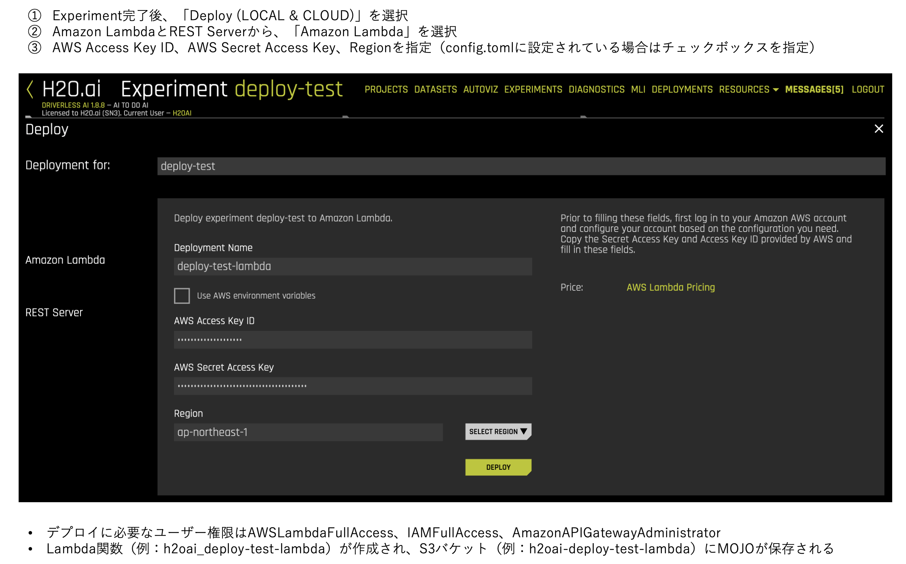
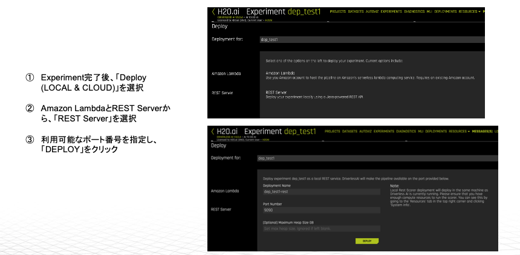

## Deploy REST API/AWS Lambda
  
### Deploy on AWS Lambda
AWS Lambdaへのデプロイと、スコアリング実行サンプル  

  
デプロイ後、Amazon API GatewayへのアクセスURLとキーが表示される  
クライアントからの実行例：[example_lambda.ipynb](example_lambda.ipynb)
  
---
### Deploy on REST API
Driverless AIサーバ上にREST APIを構築  

  
デプロイ後、APIへのアクセス例が表示される  
クライアントからの実行例(Python)：[example_RestApi_DaiServer_Python.ipynb](example_RestApi_DaiServer_Python.ipynb)
